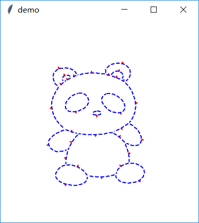

# HHShape
a tool for shape component extraction in sketch

## Requirments
- tkinter
- numpy
- matplotlib
- opencv-python
- bezier
- bresenham
- shapely

## How to use
Here we take image `panda.png` as example to demonstrate how to use our tool.
```bash
python decompose.py panda.png
```
This command will load `panda.png` and execute program.  
After loading image, which may take few minutes, you will see the following screen:  



There are red arrows attched to each stroke. What do they mean?  
First, we define region as the place surrounded by strokes.  
Second, our algorithm will assign an unique ID for each region.  
Third, it worth noting that each stroke has two sides belonging to two regions A, B.  

The arrow represent the orientation of the stroke, i.e., whether or not the region A occludes region B by this stroke.   if A occludes B, then the arrow of this stroke will point from A to B, and vice versa.  

Our algorithm will automatically find out a configuration of arrows, based on local convexity of shapes.  

You can do:
- Press <kbd>Enter</kbd> to decompose shape components of this image.
- Press <kbd>Esc</kbd> to go back to initial screen.
- Click an arrow to change its direction and then the result of decomposition.
- Draw a approximate contour to select a shape component (with local arrows adjustment). Press <kbd>a</kbd> to finish drawing.


## License

MIT License